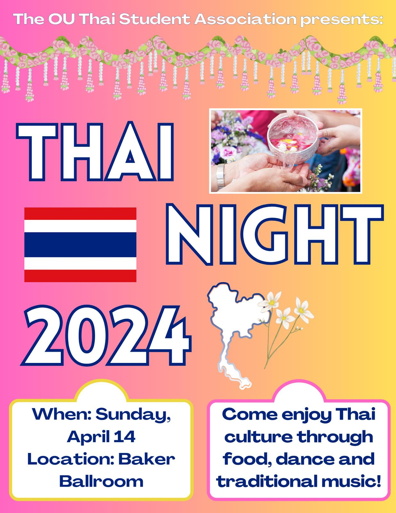

import { GatsbyImage, getImage } from "gatsby-plugin-image";

# Get Your Ticket!

Please stop by at the event venue in case we still have some tickets available.

# About

The 2024 Thai Night, themed "Celebrating 25 Years of Thai Language Instruction at OU", promises to be a vibrant and joyous occasion. The event will feature a wide
range of activities and performances designed to immerse participants in the rich culture and traditions of Thailand. Highlights include a Thai costume photo booth,
where guests can dress up in traditional Thai attire and take memorable photos; various dishes, where attendees can sample delicious Thai cuisine; and a cultural stage
show, featuring traditional Thai dance performances and music. The event will also showcase the talents of Ohio University's Thai students and provide a platform for
them to share their heritage with the wider community.

## Activities

If you are an early bird that arrives when the door opens, you can stop by at our activity tables.

<ul className="list-inside list-disc">
<li>Watering a Buddhist Image / Water blessing</li>
<li>Thai Game</li>
<li>Thai Costume Photo Shoot</li>
<li>Raffle</li>
</ul>

# Time

<ul className="list-inside list-disc">
<li>Doors open at 3pm</li>
<li>Event starts at 3:30pm</li>
<li>Event ends at 6pm</li>
</ul>

# Program

To be announced.

# Location

The event will take place in the Grand Ballroom of Baker University Center (1 Park Pl, Athens, OH 45701).

<iframe className="w-9/12 h-96 mx-auto" src="https://www.google.com/maps/embed?pb=!1m18!1m12!1m3!1d1091.2081254361972!2d-82.10207276615903!3d39.32446173472752!2m3!1f0!2f0!3f0!3m2!1i1024!2i768!4f13.1!3m3!1m2!1s0x884873bedc3f068d%3A0x6db4d34c4c94a3dc!2sBaker%20University%20Center!5e0!3m2!1sen!2sus!4v1711044278632!5m2!1sen!2sus" style={{border: 0}} allowfullscreen="" loading="lazy" referrerpolicy="no-referrer-when-downgrade"></iframe>

# Parking

There are various parking options

<ul className="list-inside list-disc">
<li>Street parking near Baker University Center.</li>
<li>Baker University Center Garage</li>
<li>Baker University Center Surface Lot</li>
<li>Athens City Parking Garage</li>
</ul>

# Posters

 

# Sponsors

  <EmbeddedImage2 className="w-1/6" style={{height: "100px"}} objectFit="contain" />
  <EmbeddedImage3 className="w-1/6" style={{height: "200px"}} objectFit="contain" />
  <EmbeddedImage4 className="w-1/6" style={{height: "100px"}} objectFit="contain" />

  <EmbeddedImage5 className="w-1/6" style={{height: "100px"}} objectFit="contain" />
  <EmbeddedImage6 className="w-1/6" style={{height: "100px"}} objectFit="contain" />
  <EmbeddedImage7 className="w-1/6" style={{height: "100px"}} objectFit="contain" />

# Credit (WIP)

This event will not be possible without the hard work and dedication that these people put in.

Note: The sections are presented in no particular order.

## The Organizing Comittee

<ul className="list-inside list-disc">
<li>Angelina Goniea-Richards - President, Thai Student Association</li>
<li>Saruda Seeharit - Vice President, Thai Student Association</li>
<li>Krerkkiat Chusap - Treasurer, Thai Student Association</li>
<li>Ellie Abbott - Member, Thai Student Association</li>
<li>Jeffrey Shane - Faculty Advisor, Thai Student Association</li>
<li>Pittaya Paladroi-Shane - Co-advisor, Thai Student Association</li>
</ul>

## Master of Ceremonies

Ahmad Junaidi (AJ)

## Stage Manager

Pittaya Paladroi-Shane

## Performance Director / Coordinator

Ellie Abbott

## The Opening Dance - เซิ้งกระติ๊บ (Sérng Gràdtíp)

Chroriographer:
<ul className="list-inside list-disc">
<li>Supaphorn Kokklang</li>
</ul>

Dancers:
<ul className="list-inside list-disc">
<li>Shirley Wang</li>
<li>Saruda Seeharit</li>
<li>Karla Mercado</li>
<li>Emma Hartberger</li>
<li>Isabella Ranieri</li>
<li>Lydia Smith</li>
<li>Cecilia Keeney</li>
<li>Gaewelyn Krisher</li>
<li>Ruby June Krisher</li>
<li>Supaphorn Kokklang</li>
</ul>

## บทเพลงพระราชนิพนธ์ในรัชกาลที่ 9 ยามเย็น (Love at Sundown)

<ul className="list-inside list-disc">
<li>Ellie Abbott (Trombone)</li>
<li>Daniel Swartz (Bass)</li>
<li>Aiden Shreves (Keyboard/Piano)</li>
<li>Cecilia Keeney (Vocal)</li>
</ul>

## เพลง ช้าง ช้าง ช้าง

Trombone:
<ul className="list-inside list-disc">
<li>Ellie Abbott</li>
</ul>

Vocals / Dancers:
<ul className="list-inside list-disc">
<li>Lydia Smith</li>
<li>Cecilia Keeney</li>
<li>Shirley Wang - President, Chinese Learners Association / Chinese Language Student Association</li>
<li>Emma Hartberger</li>
<li>Karla Mercado</li>
<li>Charlie Davey</li>
<li>Angelina Goniea-Richards</li>
</ul>

## Ponglang Music - 1st Song

Conductor / Vocal / Thai Music Workshop Instructor:
<ul className="list-inside list-disc">
<li>Dr. Supeena Insee Adler</li>
</ul>

Khene (แคน) / Thai Music Workshop Instructor:
<ul className="list-inside list-disc">
<li>Dr. Chirstopher Adler</li>
</ul>

Instruments / Vocals:
<ul className="list-inside list-disc">
<li>Thai Music Workshop Participants</li>
</ul>

## Ponglang Music - บายศรีสู่ขวัญ

Conductor / Vocal / Thai Music Workshop Instructor:
<ul className="list-inside list-disc">
<li>Dr. Supeena Insee Adler</li>
</ul>

Khene (แคน) / Thai Music Workshop Instructor:
<ul className="list-inside list-disc">
<li>Dr. Chirstopher Adler</li>
</ul>

Vocals:
<ul className="list-inside list-disc">
<li>Mink Neely</li>
<li>Rungnapha Namasa Krisher</li>
<li>Pittaya Paladroi-Shane</li>
</ul>

## Ponglang Music - 3rd Song

Conductor / Vocal / Thai Music Workshop Instructor:
<ul className="list-inside list-disc">
<li>Dr. Supeena Insee Adler</li>
</ul>

Khene (แคน) / Thai Music Workshop Instructor:
<ul className="list-inside list-disc">
<li>Dr. Chirstopher Adler</li>
</ul>

Vocals:
<ul className="list-inside list-disc">
<li>Mink Neely</li>
<li>Rungnapha Namasa Krisher</li>
<li>Pittaya Paladroi-Shane</li>
</ul>

## Thai Fashion Show

Models for the northen style clothing:
<ul className="list-inside list-disc">
<li>Ruby June Krisher</li>
<li>Quentin Cole</li>
</ul>

Models for the northeastern style clothing:
<ul className="list-inside list-disc">
<li>Supaphorn Kokklang</li>
<li>Napoleon Mensah</li>
</ul>

Models for the southern style clothing:
<ul className="list-inside list-disc">
<li>Ira</li>
<li>Ahmad Junaidi (AJ)</li>
</ul>

Models for the central style clothing:
<ul className="list-inside list-disc">
<li>Gaywalyn Krisher</li>
<li>Carmen</li>
</ul>

## Thai Trivia Game

Angelina Goniea-Richards

## Speakers for the Thai Language Program Segment

<ul className="list-inside list-disc">
<li>Ellie Abbott</li>
<li>Lydia Smith</li>
</ul>

## Speaker for the Study Aboard in Thailand Segment

Lydia Smith

## Poem "The Fate of Immigrant Children"

Isabella Ranieri

## History of Songkran Segment

Pittaya Paladroi-Shane

## Thai Film Archive Collaboration Project - The New Adventure of Hanuman - หนุมานเผชิญภัยครั้งใหม่ (1957)

Jeffrey Shane

## Dinner

Director / Dinning Floor Manager / Chaos Manager:
<ul className="list-inside list-disc">
<li>Saruda Seeharit</li>
</ul>

Director of Food Logistics:
<ul className="list-inside list-disc">
<li>William Smith</li>
</ul>

Logistics:
<ul className="list-inside list-disc">
<li>William Smith</li>
<li>Brandon Phetlasymongkhon</li>
<li>Teerayuth James Krisher (TJ)</li>
</ul>

Serving:
<ul className="list-inside list-disc">
<li>Cecilia Keeney</li>
<li>Karla Mercado</li>
<li>Emma Hartberger</li>
<li>Brandon Phetlasymongkhon</li>
<li>Rungnapha Namasa Krisher</li>
<li>Ruby June Krisher</li>
<li></li>
</ul>

Volunteers:
<ul className="list-inside list-disc">
<li>Edy Panjaitan</li>
</ul>

Director of cuteness:
<ul className="list-inside list-disc">
<li>Luna</li>
</ul>

## Registration Table

<ul className="list-inside list-disc">
<li>Angelina Goniea-Richards</li>
<li>Krerkkiat Chusap</li>
</ul>

## Activity Table - Watering a Buddhist Image / Water blessing

Preparations:
<ul className="list-inside list-disc">
<li>Pittaya Paladroi-Shane</li>
</ul>

Activity Overseer:
<ul className="list-inside list-disc">
<li>Jittakarn Risner</li>
<li>Jeffrey Risner</li>
</ul>

## Activity Table - Raffle

Preparations:
<ul className="list-inside list-disc">
<li>Angelina Goniea-Richards</li>
<li>Saruda Seeharit</li>
</ul>

Activity Overseer:
<ul className="list-inside list-disc">
<li>Emma Hartberger</li>
</ul>

## Activity Table - Thai Game

Preparations:
<ul className="list-inside list-disc">
<li>Supaphorn Kokklang</li>
</ul>

Activity Overseer:
<ul className="list-inside list-disc">
<li>Supaphorn Kokklang</li>
</ul>

## Activity Table - Thai Costume / Photo Booth

Preparations:
<ul className="list-inside list-disc">
<li>Pittaya Paladroi-Shane</li>
</ul>

Activity Overseer:
<ul className="list-inside list-disc">
<li>Rungnapha Namasa Krisher</li>
<li>Mink Neely</li>
</ul>

## Event Services Coordinator

Angelina Goniea-Richards

## ISU Coordinator

Saruda Seeharit

## Bursar Offcice / eMarket Coordinator

Angelina Goniea-Richards

## Siam Thai Coordinator

Saruda Seeharit

## Sound Engineer Coordinator

Ellie Abbott

## Pre-event Logistic Team

<ul className="list-inside list-disc">
<li>William Smith</li>
<li>Saruda Seeharit</li>
<li>Jeffrey Shane</li>
</ul>

## During-event Logistic Team

<ul className="list-inside list-disc">
<li>William Smith</li>
<li>Jeffrey Shane</li>
</ul>

## Room Decoration

<ul className="list-inside list-disc">
<li>Saruda Seeharit</li>
<li>Supaphorn Kokklang</li>
<li></li>
</ul>

## Cleaning Up Team - Food Serving Area

<ul className="list-inside list-disc">
<li>William Smith</li>
<li>Saruda Seeharit</li>
<li>Lydia Smith</li>
<li>Brandon Phetlasymongkhon</li>
</ul>

## Cleaning Up Team - Ballroom

<ul className="list-inside list-disc">
<li>William Smith</li>
<li>Saruda Seeharit</li>
<li></li>
</ul>

## Graphics Designers

<ul className="list-inside list-disc">
<li>Lydia Smith (Poster)</li>
<li>Saruda Seeharit (Ticket Design + Poster)</li>
</ul>

## Budgeting Team

<ul className="list-inside list-disc">
<li>Saruda Seeharit</li>
<li>Krerkkiat Chusap</li>
<li>Pittaya Paladroi-Shane</li>
</ul>

## Marketing Team

<ul className="list-inside list-disc">
<li>Karla Mercado</li>
<li>Emma Hartberger</li>
<li>Angelina Goniea-Richards</li>
<li>Saruda Seeharit</li>
<li>Krerkkiat Chusap</li>
<li>Pittaya Paladroi-Shane</li>
</ul>

## Ticket Selling Team

<ul className="list-inside list-disc">
<li>Angelina Goniea-Richards</li>
<li>Saruda Seeharit</li>
<li>Supaphorn Kokklang</li>
<li>Krerkkiat Chusap</li>
<li>Pittaya Paladroi-Shane</li>
</ul>

## Automation Engineer

Krerkkiat Chusap

## Special Thanks

We would like to also extend our gratitude toward these people. Without their generosity, the event would
not run as smooth as it was.

<ul className="list-inside list-disc">
<li>Elanor Skees - Assistant Director, Conference and Event Services</li>
<li>Tigistu Tiruneh Beyene - President, <a href="https://www.ohio.edu/international-student-scholar-services/international-student-union" target="_blank">International Student Union (ISU)</a></li>
<li>Staffs at <a href="http://siamthaiathens.com/" target="_blank">Siam Thai</a></li>
</ul>

We would like to also thank these organizations/units/departments for the support.

<ul className="list-inside list-disc">
<li><a href="https://www.ohio.edu/international-student-scholar-services/international-student-union" target="_blank">International Student Union (ISU)</a></li>
<li><a href="https://www.ohio.edu/oga" target="_blank">Office of Global Affairs (OGA)</a></li>
<li><a href="https://www.ohio.edu/diversity" target="_blank">Division of Diversity and Inclusion (D & I)</a></li>
<li><a href="https://www.ohio.edu/cis" target="_blank">Center for International Studies</a></li>
<li><a href="https://www.ohio.edu/engineering/" target="_blank">Russ College of Engieering and Technology</a></li>
</ul>

Last but not least, we would like to thank these companies where the free-tier / free trial of their product
help us make this event possible.

<ul className="list-inside list-disc">
<li><a href="https://github.com/" target="_blank">GitHub</a> for GitHub Pages, hosting of this website.</li>
<li><a href="https://cloud.google.com/" target="_blank">Google Cloud Platform</a> for automation / data processing of the ticket sale data.</li>
<li><a href="https://www.canva.com/" target="_blank">Canva</a> for the tool for all our digital designs.</li>
<li><a href="https://www.cloudflare.com/" target="_blank">Cloudflare</a> for the nameservers.</li>
</ul>
